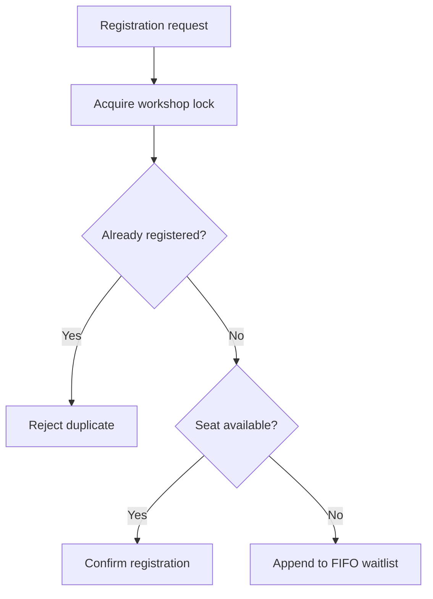

# CampusQueue

A Java 17 REST API for limited-capacity university workshops. When a workshop fills, students join a FIFO waitlist; cancelling a confirmed registration promotes the earliest waiting student.

This deadline MVP deliberately uses only JDK APIs. That keeps the concurrency and queue logic small enough to understand and test before migrating the adapters to Spring Boot and PostgreSQL.

## What it demonstrates

- Java records, enums, collections, validation, and exceptions
- Role checks for student and organizer operations
- REST endpoints built with the JDK HTTP server
- Capacity enforcement under concurrent registrations
- Fair FIFO waitlist positions
- Atomic cancellation and promotion inside a per-workshop lock
- Duplicate-registration prevention
- Structured JSON error responses
- Real HTTP integration tests using `HttpClient`

## Run

Requirements: JDK 17 or newer.

```bash
bash scripts/test.sh
bash scripts/run.sh
```

The API starts at `http://127.0.0.1:8080`. Set `PORT` to use another port.

### Windows PowerShell

Run the same Bash scripts from Git Bash, or use the JDK directly from PowerShell:

```powershell
New-Item -ItemType Directory -Force build\classes, build\test-classes | Out-Null
$main = Get-ChildItem -Recurse src\main\java -Filter *.java | ForEach-Object FullName
javac -d build\classes $main
$tests = Get-ChildItem -Recurse src\test\java -Filter *.java | ForEach-Object FullName
javac -cp build\classes -d build\test-classes $tests
java -cp "build\classes;build\test-classes" dev.achu.campusqueue.JsonTest
java -cp "build\classes;build\test-classes" dev.achu.campusqueue.CampusQueueServiceTest
java -cp "build\classes;build\test-classes" dev.achu.campusqueue.CampusQueueHttpServerTest
java -cp build\classes dev.achu.campusqueue.Main
```

## API

Create an organizer:

```bash
curl -s http://127.0.0.1:8080/api/users \
  -H 'content-type: application/json' \
  -d '{"email":"organizer@example.com","role":"ORGANIZER"}'
```

Create and publish a workshop using the returned IDs:

```bash
curl -s http://127.0.0.1:8080/api/workshops \
  -H 'content-type: application/json' \
  -d '{"organizerId":"ORGANIZER_UUID","title":"Backend Workshop","capacity":2}'

curl -s http://127.0.0.1:8080/api/workshops/WORKSHOP_UUID/publish \
  -H 'content-type: application/json' \
  -d '{"organizerId":"ORGANIZER_UUID"}'
```

Register a student:

```bash
curl -s http://127.0.0.1:8080/api/workshops/WORKSHOP_UUID/registrations \
  -H 'content-type: application/json' \
  -d '{"studentId":"STUDENT_UUID"}'
```

Cancel a registration and trigger promotion:

```bash
curl -s -X DELETE http://127.0.0.1:8080/api/workshops/WORKSHOP_UUID/registrations \
  -H 'content-type: application/json' \
  -d '{"studentId":"STUDENT_UUID"}'
```

Other routes:

| Method | Route | Purpose |
| --- | --- | --- |
| GET | `/api/workshops` | List published, active workshops |
| GET | `/api/workshops/:id` | Inspect capacity and queue state |
| POST | `/api/workshops/:id/cancel` | Cancel as the owning organizer |

## Test

Run all 25 tests using Bash or PowerShell:

```bash
bash scripts/test.sh
```

Or in PowerShell:

```powershell
java -cp "build\classes;build\test-classes" dev.achu.campusqueue.JsonTest
java -cp "build\classes;build\test-classes" dev.achu.campusqueue.CampusQueueServiceTest
java -cp "build\classes;build\test-classes" dev.achu.campusqueue.CampusQueueHttpServerTest
```

The 25-test suite covers:
- **JSON Parser & Serializer (`JsonTest` - 6 tests)**: Flat object parsing, typed values (strings, numbers, booleans, null), unescaping quotes and newlines, malformed body rejection, and model serialization.
- **Service Domain Logic (`CampusQueueServiceTest` - 12 tests)**: Capacity limits, FIFO waitlist positions, duplicate registration prevention, role authorization, cancellation promotion, waitlist queue stability after middle cancellation, seat reuse after cancellation, lifecycle state transitions (draft/published/cancelled), owner-only controls, input validation, workshop listing filters, and concurrent registration/cancellation thread safety.
- **HTTP Server Integration (`CampusQueueHttpServerTest` - 7 tests)**: Real HTTP requests against JDK HTTP server for all REST routes, HTTP registration and promotion via `DELETE`, workshop details and cancellation via `POST`, 404 routing for invalid subpaths and methods, structured 400 validation error responses, and HTTP response security headers (`nosniff`, `no-store`).

## Concurrency decision

Each workshop owns a fair `ReentrantLock`. Registration checks for duplicates, checks confirmed count, and appends to the waitlist while holding that lock. Cancellation removes a registration and promotes with `pollFirst()` before releasing it. The concurrency test sends 20 registrations through eight threads to a capacity-three workshop and asserts exactly three confirmations plus 17 unique waitlist positions.

## Registration flow



`CampusQueueHttpServer` is the HTTP adapter; `CampusQueueService` owns validation, role checks, capacity, and queue behavior. Keeping those boundaries separate makes the domain easy to test and later replace with Spring Boot controllers and PostgreSQL repositories.

## Honest limitations and next iteration

- State is in memory and resets when the process stops.
- Users are identified by UUID in this MVP; authentication is not implemented here.
- The JSON reader intentionally supports the flat request objects used by this API, not arbitrary JSON.
- The next iteration will move persistence to PostgreSQL, use database row locks and unique constraints, and add Spring Security with JWT authentication.

These limitations are not hidden: the project is a tested domain-first increment rather than a pretend production deployment.
