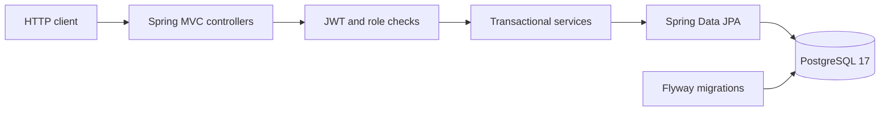
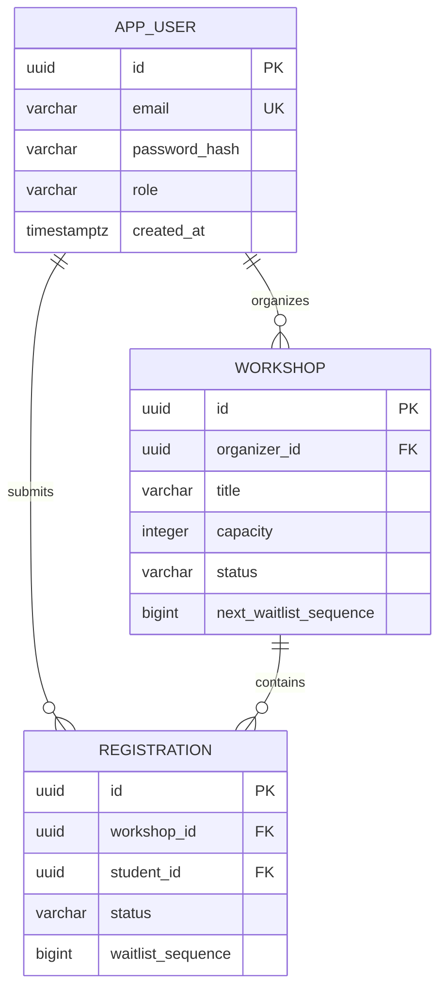
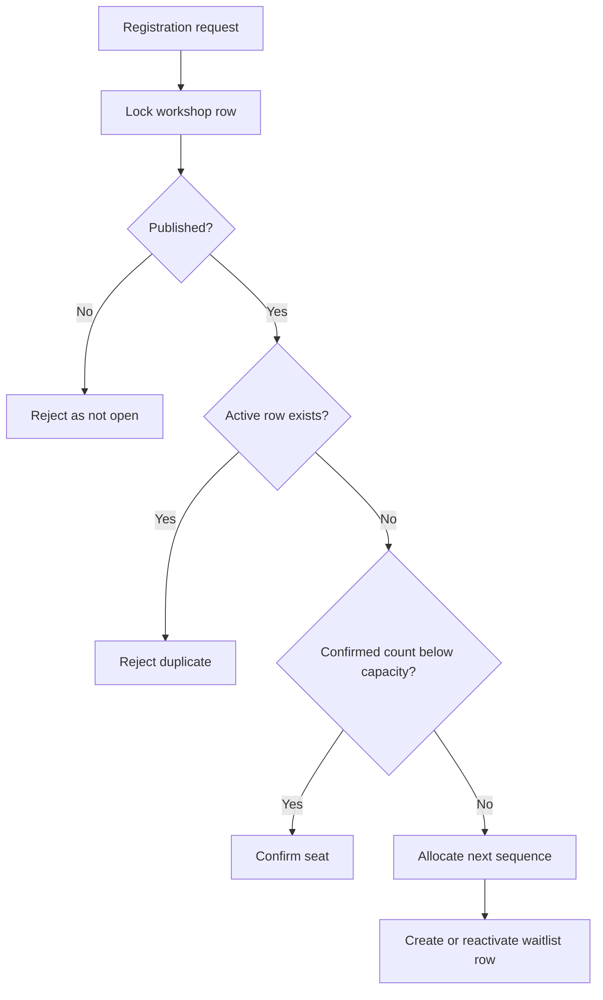

# CampusQueue

CampusQueue is a Spring Boot REST API for limited-capacity university workshops. Organizers manage workshop lifecycles and rosters; students receive a confirmed seat or enter a deterministic FIFO waitlist. Cancellations and registrations remain capacity-safe under concurrent requests because PostgreSQL—not a JVM-only lock—is the serialization boundary.

## Verified project facts

- Java 17, Spring Boot 3.5, Spring Security, JPA/Hibernate, Flyway, and PostgreSQL 17.
- JWT registration/login with BCrypt password hashing and role-based authorization.
- Database-backed capacity enforcement, FIFO waitlisting, cancellation, and automatic promotion.
- Owner-only organizer controls for capacity, rosters, publishing, and cancellation.
- Published-only, case-insensitive workshop search with bounded pagination.
- OpenAPI JSON and Swagger UI, Docker Compose, and a non-root runtime image.
- **28 integration tests** passed in GitHub Actions against a real PostgreSQL Testcontainer.
- The concurrency scenario ran five times; each run processed 20 students over eight threads and produced exactly **3 confirmed + 17 waitlisted** registrations for a capacity-three workshop.

The verified implementation is on `feat/campusqueue-v2`. The original dependency-free prototype remains available at commit [`da512f1`](https://github.com/Achintya-Narula/campus-queue/tree/da512f1d03b219c931a365fec956c8aa3de1e1c0).

## Architecture



Controllers accept HTTP input and derive identity from the signed JWT subject. Services own lifecycle, ownership, capacity, and queue rules. Repositories provide persistence and the pessimistic workshop-row lock. Flyway owns the schema; Hibernate validates it at startup rather than creating it.

### Data model



The database enforces one row per workshop/student pair. Waitlisted rows must have a positive sequence; confirmed and cancelled rows must not have one.

## Registration transaction



`PESSIMISTIC_WRITE` on the workshop row is the single serialization point for enrollment, student cancellation, capacity changes, and workshop cancellation. A confirmed cancellation promotes the smallest active waitlist sequence in the same transaction. This keeps multiple application instances consistent without `ReentrantLock`, Redis, or retry-based overbooking repair.

## Run with Docker Compose

Requirements: Docker Desktop or Docker Engine with Compose.

### Bash

```bash
cp .env.example .env
# Replace POSTGRES_PASSWORD and JWT_SECRET in .env before shared or deployed use.
docker compose up --build
```

### Windows PowerShell

```powershell
Copy-Item .env.example .env
# Edit .env and replace POSTGRES_PASSWORD and JWT_SECRET.
docker compose up --build
```

The API starts at `http://localhost:8080`.

- Swagger UI: `http://localhost:8080/swagger-ui.html`
- OpenAPI JSON: `http://localhost:8080/v3/api-docs`
- Stop services: `docker compose down`
- Stop services and delete local database data: `docker compose down --volumes`

The last command is destructive because it removes the named PostgreSQL volume.

## Run from source

Requirements: JDK 17, PostgreSQL 17, and Docker for the Testcontainers suite.

### Bash

```bash
export DB_URL='jdbc:postgresql://localhost:5432/campusqueue'
export DB_USERNAME='campusqueue'
export DB_PASSWORD='your-local-password'
export JWT_SECRET='replace-with-a-random-secret-containing-at-least-32-bytes'
export JWT_TTL='PT1H'
./mvnw spring-boot:run
```

### Windows PowerShell

```powershell
$env:DB_URL = 'jdbc:postgresql://localhost:5432/campusqueue'
$env:DB_USERNAME = 'campusqueue'
$env:DB_PASSWORD = 'your-local-password'
$env:JWT_SECRET = 'replace-with-a-random-secret-containing-at-least-32-bytes'
$env:JWT_TTL = 'PT1H'
.\mvnw.cmd spring-boot:run
```

Flyway applies `V1__create_campusqueue_schema.sql` automatically. The application fails startup if Hibernate detects a schema mismatch.

## Configuration

| Variable | Purpose | Local default |
| --- | --- | --- |
| `DB_URL` | PostgreSQL JDBC URL | `jdbc:postgresql://localhost:5432/campusqueue` |
| `DB_USERNAME` | Database user | `campusqueue` |
| `DB_PASSWORD` | Database password | `campusqueue` |
| `JWT_SECRET` | HS256 signing secret; minimum 32 UTF-8 bytes | Development placeholder |
| `JWT_TTL` | Token lifetime as an ISO-8601 duration | `PT1H` |
| `API_PORT` | Host port used by Compose | `8080` |

Never commit a real password, JWT secret, `.env` file, or access token. The checked-in `.env.example` contains placeholders only.

## API overview

| Method | Route | Access | Purpose |
| --- | --- | --- | --- |
| `POST` | `/api/v1/auth/register` | Public | Create a student or organizer account |
| `POST` | `/api/v1/auth/login` | Public | Obtain a JWT |
| `GET` | `/api/v1/workshops?q=&page=0&size=20` | Public | Search published workshops |
| `GET` | `/api/v1/workshops/{workshopId}` | Public | Read one published workshop |
| `POST` | `/api/v1/organizer/workshops` | Organizer | Create a draft workshop |
| `PUT` | `/api/v1/organizer/workshops/{workshopId}` | Owner | Edit details or capacity |
| `POST` | `/api/v1/organizer/workshops/{workshopId}/publish` | Owner | Publish a draft |
| `GET` | `/api/v1/organizer/workshops/{workshopId}/roster` | Owner | View confirmed and FIFO waitlisted students |
| `POST` | `/api/v1/organizer/workshops/{workshopId}/cancel` | Owner | Cancel workshop and active registrations |
| `POST` | `/api/v1/workshops/{workshopId}/registrations` | Student | Confirm or join waitlist |
| `DELETE` | `/api/v1/workshops/{workshopId}/registrations/me` | Student | Cancel own registration and trigger promotion |
| `GET` | `/api/v1/me/registrations` | Student | List only the authenticated student's records |

Copy-pasteable requests are in [`docs/api-examples.http`](docs/api-examples.http). Student and organizer IDs are never accepted from management/enrollment request bodies; identity comes from the JWT.

## Test evidence

Run the same verification command used in CI:

```bash
./mvnw clean verify
```

```powershell
.\mvnw.cmd clean verify
```

The integration suite requires a running Docker daemon because Testcontainers starts PostgreSQL 17. The 28 verified tests cover:

| Area | Tests | Evidence |
| --- | ---: | --- |
| Authentication and API errors | 5 | BCrypt, normalization, JWT success/failure, safe 401/403 |
| Flyway migration | 1 | Real PostgreSQL schema and uniqueness/check constraints |
| Workshop lifecycle | 4 | Create, edit, publish, ownership, visibility, validation |
| Enrollment | 4 | Capacity, FIFO position, identity isolation, reactivation |
| Student cancellation | 2 | Atomic cancellation, promotion, repeat handling |
| Organizer management | 3 | Capacity floor, roster privacy/order, workshop cancellation |
| Concurrency | 6 | Five 20-student repetitions plus mixed cancel/register race |
| Public API and OpenAPI | 3 | Search, pagination bounds, Swagger/bearer contract |
| **Total** | **28** | **0 failures in the verified CI run** |

GitHub Actions also validates Compose and builds the runtime image after Maven verification.

## Design choices and tradeoffs

- **Database lock instead of JVM lock:** works across multiple API instances, at the cost of serializing mutations for the same workshop.
- **Monotonic waitlist sequence:** cancelled sequence numbers are not reused. Positions are calculated from active earlier sequences, keeping FIFO deterministic without renumbering rows.
- **One registration row per student/workshop:** cancelled rows are reactivated, preserving uniqueness and audit continuity.
- **HS256 JWTs:** appropriate for this single service and simple local deployment. A multi-service system would usually use asymmetric keys, rotation, and a dedicated identity provider.
- **Explicit public page DTO:** avoids exposing unstable Spring `Page` serialization details to clients.

## Current limitations

- No frontend, email/push notifications, calendar integration, or attendance tracking.
- No JWT refresh, revocation list, rate limiting, or account-recovery flow.
- No deployment manifest or public hosted environment; Docker Compose is for local/review use.
- No full audit-event table; timestamps and registration-row reactivation provide only basic history.
- Search uses PostgreSQL string matching, not full-text search.

These are deliberate boundaries for a focused backend project. Future work should be driven by a real requirement rather than added only to increase the technology list.
